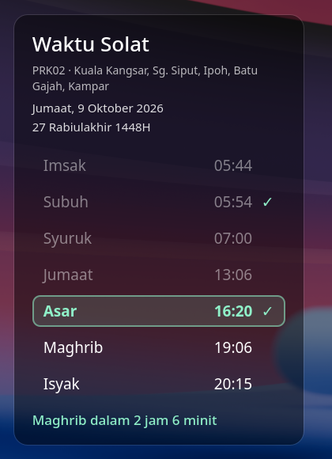

# solat-lock

Malaysian prayer times from [JAKIM e-solat](https://www.e-solat.gov.my) on the KDE Plasma 6 lock screen.



- All 60 JAKIM zones, picked in System Settings
- Gregorian and Hijri dates, with a countdown to the next prayer
- The current prayer is highlighted
- Tap a prayer on the lock screen to tick it off ✓
- Notifications ask "Sudah solat?" when each prayer time starts, and remind you until you mark it done
- Works offline: about 60 days of times are cached, with a warning if updates stop
- Malay or English, 24h or 12h

## How it works

KWin doesn't support `ext-session-lock`, so this doesn't replace the KDE locker. KDE still does the locking and checks your password. The project has two parts:

- **`solat-lock`** (Rust): downloads the timetable and stores it in `kscreenlockerrc`, sends the notifications, and keeps track of which prayers are done.
- **`solat.lockscreen`** (QML): a Plasma wallpaper plugin used on the lock screen. It draws the panel above the blur that appears when you move the mouse.

## Install

### Arch Linux

```sh
git clone https://github.com/qatoqat/solat-lock
cd solat-lock/packaging/arch
makepkg -si
solat-lock setup        # as your user, not root
```

### Other distros (from source)

You need Rust, Plasma 6, `kpackagetool6` and `kwriteconfig6`.

```sh
./install.sh            # installs to ~/.cargo/bin and ~/.local/share
./uninstall.sh          # undo
```

Then open **System Settings → Screen Locking → Configure Appearance…** and pick your zone. The default is PRK02.

## Usage

```
solat-lock show          today's times and check marks
solat-lock done [PRAYER] mark a prayer done (default: the current one)
solat-lock undo PRAYER   unmark it
solat-lock zone [CODE]   print or set the zone
solat-lock sync --force  re-download now
```

Prayer names: `subuh`, `zohor` (or `jumaat`), `asar`, `maghrib`, `isyak`. English names also work.

These user services are enabled by `solat-lock setup`:

| Unit | Purpose |
| --- | --- |
| `solat-lock.timer` | Daily sync, plus one 30 s after login |
| `solat-lock.path` | Re-sync when the zone changes in System Settings |
| `solat-lock-notify.service` | Prayer notifications and reminders |

Done history is kept in `~/.local/state/solat-lock/done.json`.

## Notes

- Tapping on the lock screen saves your check-off only if `kscreenlocker` is built without its seccomp sandbox, as Arch builds it. With the sandbox, the tick shows but isn't saved.
- Anyone at your locked computer can tick or untick today's prayers. They can't do anything else.

## License

GPL-2.0-or-later
